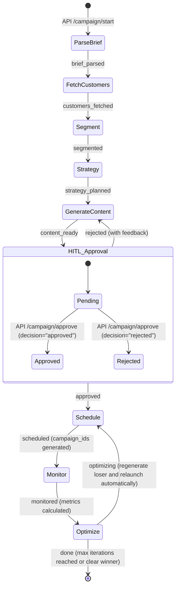

# CampaignX Agent Lifecycle State Diagram

## Description
- **ParseBrief**: Extracts product names, USPs, and offers from raw text.
- **FetchCustomers**: Gathers customer cohorts from DB/API.
- **Segment**: Slices customers into A and B groups for testing.
- **Strategy**: Determines overarching communication plan.
- **GenerateContent**: Uses LLM to draft Email A and B incorporating any provided rejection feedback.
- **HITL_Approval**: Execution pauses. Waits for human reviewer to submit decision and optional feedback.
- **Schedule**: Triggers external email sender API.
- **Monitor**: Gathers open/click rates.
- **Optimize**: Chooses the winning variant using live report metrics, regenerates the losing content, relaunches automatically, or finishes after the max iteration count.
